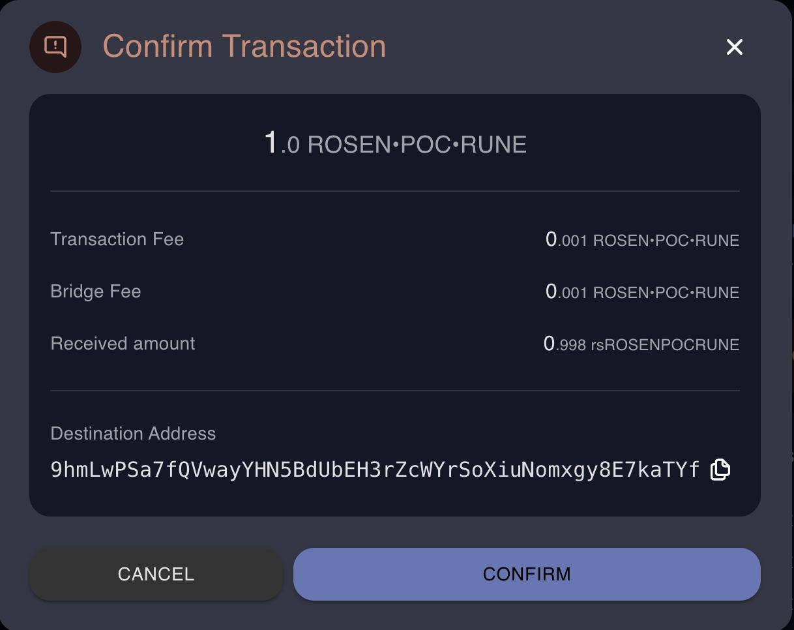
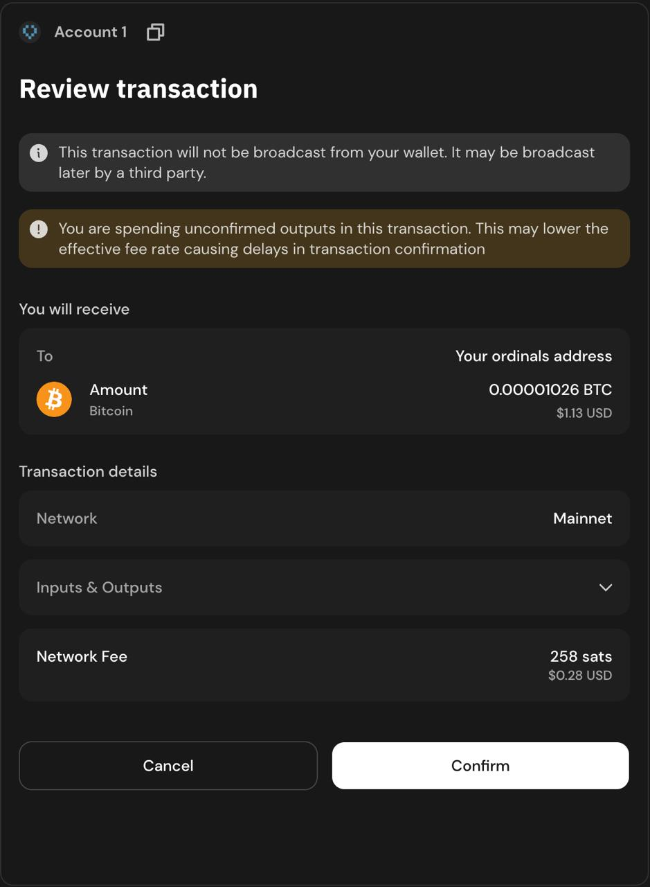
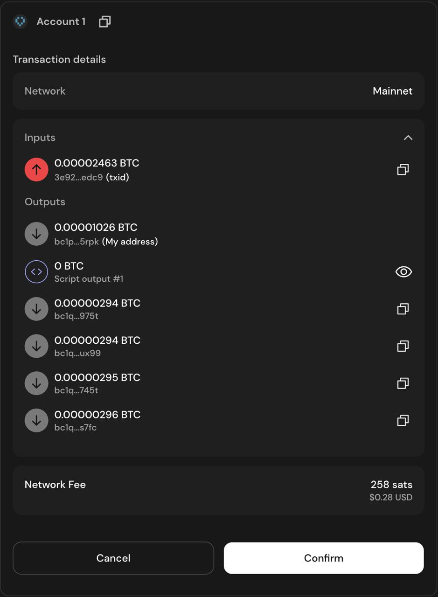
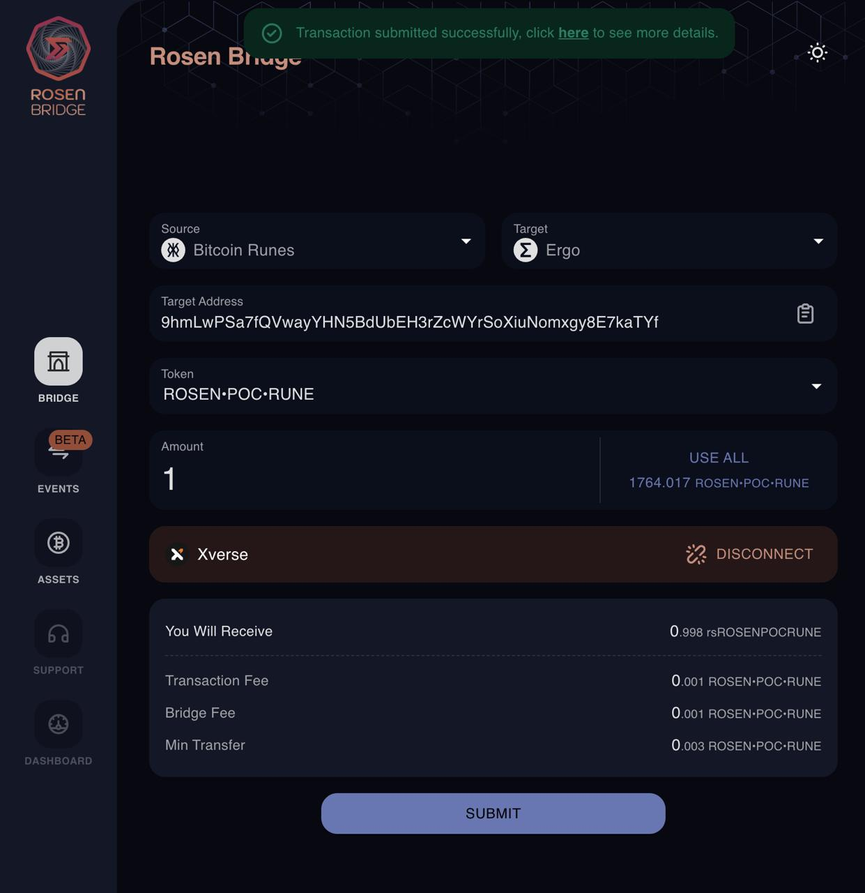

# Bitcoin Runes Integration in Rosen Bridge

This document outlines the integration of Bitcoin Runes modules into the [Rosen Bridge UI repository](https://github.com/rosen-bridge/ui).

## Contents
- [Bitcoin Runes Integration in Rosen Bridge](#bitcoin-runes-integration-in-rosen-bridge)
  - [Contents](#contents)
  - [UI Integration](#ui-integration)
    - [Base Data](#base-data)
    - [Asset Calculator](#asset-calculator)
    - [Rosen Service](#rosen-service)
    - [Network Package](#network-package)
    - [Wallet Package](#wallet-package)
    - [Wallet Configuration in Rosen App](#wallet-configuration-in-rosen-app)
  - [Proof of Concept](#proof-of-concept)

## UI Integration
Similar to the Watcher and Guard services integrations in the previous milestone, the integration follows the [Rosen Bridge Expansion Kit Document](https://github.com/rosen-bridge/rcs/tree/master/rcs-003), with minor differences in certain cases, such as the scanner and health-check.

### Base Data
Before implementing the required modules in the UI, some base data, such as constants and packages, needed to be defined. Due to dependencies, all these changes were integrated into a single merge request. The data was added with minimal modifications to reduce the complexity of the merge, and each module was fully implemented separately.

In parallel, other Bitcoin Runes packages (such as extractors) were under development, and some major changes were made, including renaming the chain from `"runes"` to `"bitcoin-runes"`. This change impacted all constants and package names and was applied to the UI repository before implementing the UI modules.

Related Commits:
- [Base Data](https://github.com/rosen-bridge/ui/commit/8f192d7436d81f53cdcb4cfed8c414baeb5e16bf)
- [Runes Rename](https://github.com/rosen-bridge/ui/commit/8ef077bf37eb5100b205d9dbdd04dd7e72dc7640)

### Asset Calculator
The Asset Calculator is the package responsible for capturing the balance of all supported assets on Rosen Bridge addresses. This data is displayed on the [Rosen App Assets page](https://app.rosen.tech/assets).

For Bitcoin Runes, the data is fetched from [Unisat](https://unisat.io/) APIs. Rune information, such as decimals and total supply, is retrieved from the [`getRuneInfo`](https://github.com/unisat-wallet/unisat-dev-docs/blob/master/open-api/auto-generated/docs/runes-indexer.md#get-rune-info-by-runeid) route, while the balance of the address is fetched from the [`getRunesBalanceList`](https://github.com/unisat-wallet/unisat-dev-docs/blob/master/open-api/auto-generated/docs/runes-indexer.md#get-runes-balance-by-address-and-runeid) route.

Related Commits:
- [Main Integration](https://github.com/rosen-bridge/ui/commit/9a8d18a97007e6cc435ffc50849b666baad52fb2)

### Rosen Service
All extractors and most chain-specific packages of Rosen, such as the Observation Extractor and Asset Calculator, should be integrated so that the data is displayed on Rosen App pages. These packages were all integrated into the Rosen service. Additionally, the required configurations, such as the Unisat URL and API key, were added to the Rosen service.

Related Commits:
- [Main Integration](https://github.com/rosen-bridge/ui/commit/3057f0c925ff5c074c3cf71901f557ae3170ba10)

### Network Package
In the first stage, a new network package was initialized for Bitcoin Runes. In this stage, the package was fully implemented. The logic and structure of the lock transaction, as described in previous milestones, remained unchanged. An example script was also published as a [GitHub gist](https://gist.github.com/RaaCT0R/695694a32b475e44bf50264086d8be61). 

There are only two minor differences between the example script and the current implementation:
1. The lock address is Native-Segwit, while the script uses a Taproot address.
2. The UI uses the `"@magiceden-oss/runestone-lib"` package instead of `"runelib"` due to the latter's insufficiency (as described in milestone 3).

Related Commits:
- [Main Integration](https://github.com/rosen-bridge/ui/commit/8e1794585c8462d1b841275d44a2de67b4297314)

### Wallet Package
Once the network package was implemented, it was integrated into an existing wallet or a new wallet was added for it. For Bitcoin Runes, the [xVerse](https://www.xverse.app/) wallet was used, which is already supported in Rosen Bridge for Bitcoin transfers. Thus, the Bitcoin Runes network was added to it with support for switching between Bitcoin and Bitcoin Runes (since Rosen treats them as separate chains).

Related Commits:
- [Main Integration](https://github.com/rosen-bridge/ui/commit/74eb05b36a773c9ba2c83d54068933690bcf23b8)

### Wallet Configuration in Rosen App
The final stage involved integrating the wallet into the Rosen App. Since xVerse was already supported, only the required environment variables were added to the example file, and xVerse was updated to support the Bitcoin Runes chain.

Related Commits:
- [Main Integration](https://github.com/rosen-bridge/ui/commit/013fc5c045ea7273b7f6d612f89f7a1d6b250ea7)

## Proof of Concept
Example of Rosen form and xVerse popup while bridging Bitcoin Runes: 

    
    <em>Rosen App Confirmation on Bridge Request</em>

    
    <em>xVerse Wallet Popup for Sign</em>

    
    <em>xVerse Wallet Popup for Sign (UTxOs list)</em>

    
    <em>Rosen App After Submitting Bridge Request (<a href="https://web3.okx.com/explorer/bitcoin/tx/7ef00da9bfb85d6227142c6c071b170cc8a27386eb0790ff41848842761280c4">transaction link</a>)</em>

