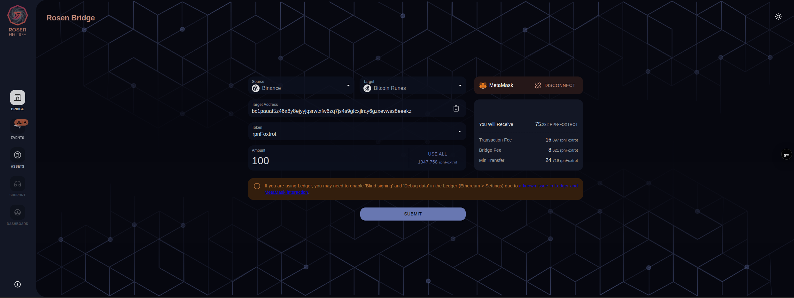
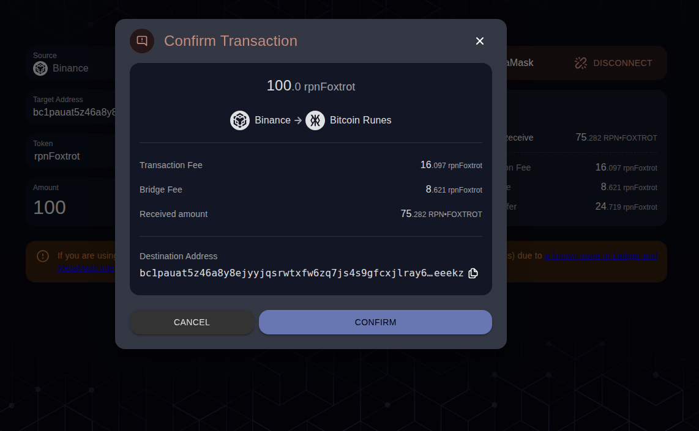
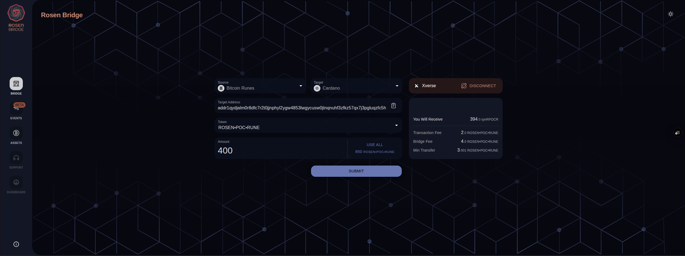
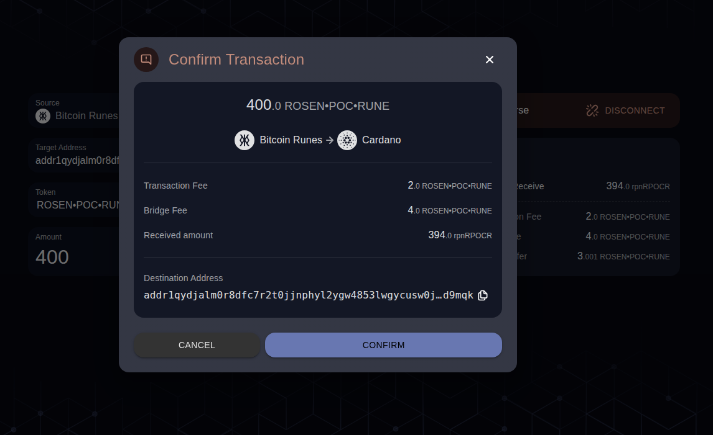
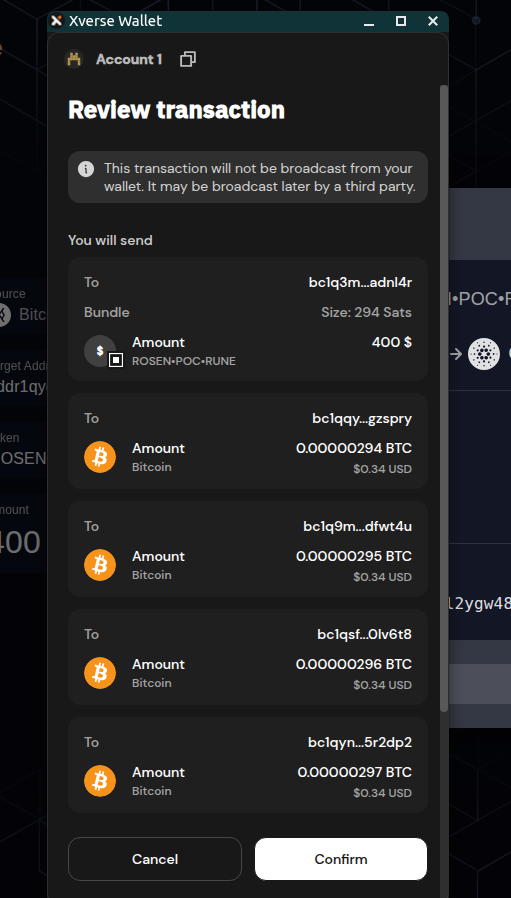
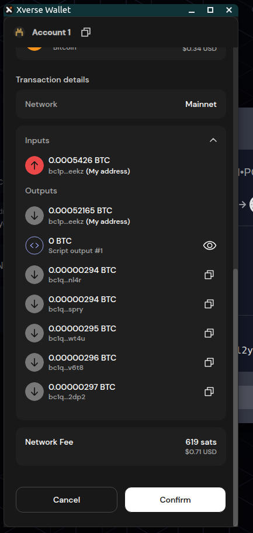
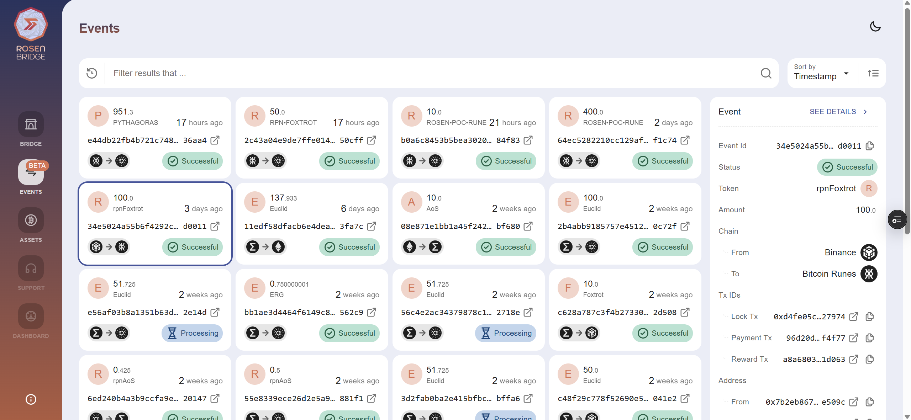
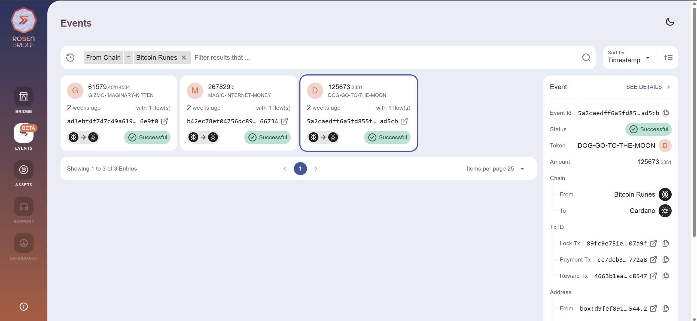

# Bitcoin Runes Integration in Rosen Bridge

Final document on the integration of Bitcoin Runes in Rosen Bridge reports the testing result.

## Contents
- [Test on Pandora](#test-on-pandora)
    - [Bridge to Bitcoin Runes](#bridge-to-bitcoin-runes)
    - [Bridge from Bitcoin Runes](#bridge-from-bitcoin-runes)
- [Production](#production)

## Test on Pandora
In final stage, the Bitcoin Runes id deployed on Pandora, the test environment of Rosen Bridge on Mainnet (the addresses are available in [Contract Repository](https://github.com/rosen-bridge/contract/releases) with `pandora` suffix). Three Runes with different characteristics are bridged to Cardano. Also a supported Binance token is wrapped on Bitcoin as Runes and bridged. Here are summary of the events with images:

### Bridge to Bitcoin Runes

Event Id: `34e5024a55b6f4292c88984a6fde8cb87e3fa0af1bd973c90337e85552bd0011`
- Lock `rpnFoxtrot` on Binance: https://bscscan.com/tx/0xd4fe05ca18d3044f5bde466c64dba96c1429609e5cdc232036e81f8dfeb27974
- Commitments by Binance Watchers:
    - https://explorer.ergoplatform.com/en/transactions/6cb4c1a0bb2379a96e3cb30a77a0ebe79d76657eb72b5f9cdd0492c0d52ed67c
    - https://explorer.ergoplatform.com/en/transactions/918432aa06bb3acea86bf216c6129c6c8e757973480daec5709883ba4cf46946
    - https://explorer.ergoplatform.com/en/transactions/bd1637aad819da149c787b823c31996cb16f53b64a68f0594ed2981766c4c5d5
    - https://explorer.ergoplatform.com/en/transactions/d1822904c4b73287b5872c765d029133693aa49625add8e15a5793785c8c5887
    - https://explorer.ergoplatform.com/en/transactions/5216da79c3ac1a373eb8fdc2dcac7f4a2f6c04434668b2d19baf8b75dca6618a
- Event Trigger: https://explorer.ergoplatform.com/en/transactions/0a3445ed8bb126ce845d1bff6a59f595ce3e95ae0854866f7b31a8197235d0b8
- Payment on Bitcoin: https://web3.okx.com/explorer/bitcoin/tx/96d20dfc2605fb550170dd94af96122a44f3014cc38afe94ad448774e70f4f77
- Reward Distribution: https://explorer.ergoplatform.com/en/transactions/a8a680398003cfa0ba7d5c73904e77a476460081e4ba45eb56cfa7da8311d063

    
    <em>Bridge <code>rpnFoxtrot</code> from Binance to Bitcoin Runes</em>

    
    <em>Confirmation Popup</em>

### Bridge from Bitcoin Runes

Event Id: 64ec5282210cc129afd65263f553dac0dbd230bc482050a8ee9939a70e6f1c74
- Lock `ROSEN•POC•RUNE` on Bitcoin: https://web3.okx.com/explorer/bitcoin/tx/baf082d24c4e878a2ca823cadac341509d767335fe0c478d75328f4d3b28fddf
- Commitments by Binance Watchers:
    - https://explorer.ergoplatform.com/en/transactions/47f07d02aefb86b44f24747f3f414e637e01408c9698c77c88cb0ec9a7f9aaff
    - https://explorer.ergoplatform.com/en/transactions/8c8bb361c0bf905c6d1bd2f626c54c3968f5f4aa2190774c96fe6a6c63071a9c
    - https://explorer.ergoplatform.com/en/transactions/97a6bf50c42b85ba68f1d449aa548028d95ab1bb8bdc53bba8992141018384db
    - https://explorer.ergoplatform.com/en/transactions/e561dcda8e0cc90c0a2bd7c59ccd3319b7200051448d72a73446bd41c5716bad
    - https://explorer.ergoplatform.com/en/transactions/5d59530979239d16538b3dcca4fd6254a6971c236da3707943c1cefa5a5165b3
- Event Trigger: https://explorer.ergoplatform.com/en/transactions/27b2ca87af989fca805863a185c84fcf1f78f0044b37aa527fd144fa21aef1a3
- Payment on Cardano: https://cardanoscan.io/transaction/0195a2922a97d8d5855f8641455ac4a7a1ea7756faca0c03430d82e08ee982af
- Reward Distribution: https://explorer.ergoplatform.com/en/transactions/ef1326d65426cb3a7545eb13f9a2ae7ca9c50fffab7fa9124d5f36e2cb1a93f8

    
    <em>Bridge <code>ROSEN•POC•RUNE</code> from Binance to Bitcoin Runes</em>

    
    <em>Confirmation Popup</em>

<table align="center">>
  <tr>
    <td align="center">
       
      <em>Wallet Popup (Assets)</em>
    </td>
    <td align="center">
       
      <em>Wallet Popup (UTxOs)</em>
    </td>
  </tr>
</table>

Event Id: `2c43a04e9de7ffe01445e4a27bee16c5ac201ebbc063f269ef70864d12e50cff`
- Lock `RPN•FOXTROT` on Bitcoin: https://web3.okx.com/explorer/bitcoin/tx/9425a8bcf982bad75928536bf26bb81b360360a78aa42d084db32421f4caa9fd
- Commitments by Binance Watchers:
    - https://explorer.ergoplatform.com/en/transactions/8ba2045bf6d068f86da149fd4e6d4046f587d98c0de3c3194f0f9d531ccfc33f
    - https://explorer.ergoplatform.com/en/transactions/09df770202dc43ab3316e7b23615255eb6b758360ee3175a58c97af565a59f39
    - https://explorer.ergoplatform.com/en/transactions/1fcef44e6477985789b16edab9b6cc1992d6de7f69889f8570ed166ae0057a7f
    - https://explorer.ergoplatform.com/en/transactions/a10aad458236a70536511f826935dd80efd03ee360baa0686cc6a835ea178fc4
    - https://explorer.ergoplatform.com/en/transactions/d1e6721e67a4896fbf906c0401eeddb37f44ddf7003d8336076a9dde4c279063
- Event Trigger: https://explorer.ergoplatform.com/en/transactions/249cf27b1fbaf6c2199be48e4964b5a1d6a0b93e200cc895ea2b34710d78031f
- Payment on Cardano: https://cardanoscan.io/transaction/bdc5a37131eb2a3deaa852897ff42fcf2a8d97f60be9e7652c14af2fbbf713c3
- Reward Distribution: https://explorer.ergoplatform.com/en/transactions/85108211f77de4149fcd58801214ebb516903a996b2a554e8329a6872a611343

Event Id: `e44db22fb4b721c748edf4255875f826c035f24a4a88423e349bb89f08a36aa4`
- Lock `PYTHAGORAS` on Bitcoin: https://web3.okx.com/explorer/bitcoin/tx/20757ed765fe283508d2db296d8a305aea3f203e01302c97f2455aeb69c42994
- Commitments by Binance Watchers:
    - https://explorer.ergoplatform.com/en/transactions/31ace2780d2fce4ef6f6718588edc1a4eaac19dfe4463b2d3eaf2a3df0f89ebe
    - https://explorer.ergoplatform.com/en/transactions/56377ace0b16838a18cbefc352aea692aa9be02015d5c25787dd391ee701089c
    - https://explorer.ergoplatform.com/en/transactions/628de490ca8733d2dcd1c7b1dbbef14701865a0f603c69d4633bb9c96bcfa28e
    - https://explorer.ergoplatform.com/en/transactions/be2b63ede83f8e47fff017303f2bbc1662a4ff7c2f16778cf581d05c1d9c301d
    - https://explorer.ergoplatform.com/en/transactions/c28ff9a6c427beaa63f72eddf13d838d71efd774bac440024eba7b61eb9c55be
- Event Trigger: https://explorer.ergoplatform.com/en/transactions/660d780c47cde8d84f5af4c74549f720622ce8d9f6d4d87c59a23ab35b157ec0
- Payment on Cardano: https://cardanoscan.io/transaction/707ea268e89af5e0d759cf30fcf98d87f3ed73d30d7fe3b6f999002dc7d3d103
- Reward Distribution: https://explorer.ergoplatform.com/en/transactions/8111699dfc358f893b3fb72c39af705df914916b2265020b38a25114b9d8db63

    
    <em>Summay of the events in <a href="https://ui-rosen-git-dev-rosen-bridge.vercel.app/events">Rosen Pandora Events page</a></em>

## Production
After a successful test on Pandora, the Bitcoin Runes is deployed on production. 7 Runes with high market cap are wrapped to the supported chains (Ergo, Cardano, Ethreum and Binance) and 11 assets (5 native tokens such as ERG and ADA, and 6 Ergo tokens) are wrapped to Bitcoin as Runes. These events are performed to bridge 3 different Runes to Cardano:

Event Id: `5a2caedff6a5fd855f934ae240cba97ffd67c464dc7610f0fca1cf5acbdad5cb`
- Lock `DOG•GO•TO•THE•MOON` on Bitcoin Runes: https://uniscan.cc/tx/89fc9e751eeceeaebd05a232d303b6a032f34d1db38633d7e6056b2254607a9f
- Commitments by **Bitcoin Runes** Watchers:
    - https://explorer.ergoplatform.com/en/transactions/2b57eddc72c879b207006b8d5a0388c00bd97e7e539021224846e9f03aacd582
    - https://explorer.ergoplatform.com/en/transactions/7ad6936e42ff8e02fca44ded08a87385cdac6a619995b63fcb81f79a2fe0726c
    - https://explorer.ergoplatform.com/en/transactions/7cf6015d780fd074368007433d86333ccb49647ea1dd635c0f739d5c7a3328cf
    - https://explorer.ergoplatform.com/en/transactions/bbd6e8085b8032dacb37fe14f8c6da4fba8b047b912188bda94a93ab76af0cf0
    - https://explorer.ergoplatform.com/en/transactions/f51a324ad04db54b7d89896bbd14e6a4a698cdaf9af5a5866177c43f0e1ef73c
    - https://explorer.ergoplatform.com/en/transactions/33227e038f972f66f9fa3073165d9a508719d4e77fa34bf95ab9a003b9f51d33
    - https://explorer.ergoplatform.com/en/transactions/470e99b8549f4cda48fbf2b6ee8b223011cf6d40e3d6269e3dd705c8e2b41638
    - https://explorer.ergoplatform.com/en/transactions/517d4d91c278c46afa6fd52db8f65ae9b91ba12e1ba7f968fcce684a172c0be1
    - https://explorer.ergoplatform.com/en/transactions/841133097d267d5e83135d7b2064e807fb2be78e69c12f4801bbedd0fa885f96
    - https://explorer.ergoplatform.com/en/transactions/e835824892a4ba86140bdab4b59d2f11f902966083b97526f03f0ce592e4848f
    - https://explorer.ergoplatform.com/en/transactions/af8d32a900cb09e5d3e8dfadc2f1132747ef4810500dfba63ed536a47e1c244e
    - https://explorer.ergoplatform.com/en/transactions/10e5e218d40524f8466ea94f6504a0a9e0c100afb638ad9c441d5c1f3e5b0887
    - https://explorer.ergoplatform.com/en/transactions/1772cbba3efdbc6271b6ae71847d232cfdaaa04dda3193d69e4aa64f1106aab8
- Event Trigger: https://explorer.ergoplatform.com/en/transactions/0161ed76a7a23eb030dce4399f1a3439920de500dcfb766d4acd25b818c4fc59
- Payment on Cardano: https://cardanoscan.io/transaction/cc7dcb3f2909905ccdd9f0bec12b747f5b3125efb7f2c61746a32589535772a8
- Reward Distribution: https://explorer.ergoplatform.com/transactions/4663b1ea98c1f47f1aca01d76638d49174d06cffc11932d0155082f4a3fc8547

Event Id: `b42ec78ef04756dc89f38348ce6196a924df7086a12bd0c408dc0ff6d3a66734`
- Lock `MAGIC•INTERNET•MONEY` on Bitcoin Runes: https://uniscan.cc/tx/5b50bbde61f27f07feb0738590c76da09ec5d95e62c384f734254063066123cd
- Commitments by **Bitcoin Runes** Watchers:
    - https://explorer.ergoplatform.com/en/transactions/1057a4a8c143a869ebee2e34224c51d237ee1fd7edcc6c91ddc0083cc854881e
    - https://explorer.ergoplatform.com/en/transactions/335c22c6c5af0f614b0997df684eafaf2f2804932aa9134efb08b52af0fc79d3
    - https://explorer.ergoplatform.com/en/transactions/3575e46e351f40e142d68a8c3883d09a4d1b8e6b12ffd2ed62366212e93035ce
    - https://explorer.ergoplatform.com/en/transactions/39f6bc32aacad87ad7de957a06311d5892e4f0833ac34840195d0ef192775345
    - https://explorer.ergoplatform.com/en/transactions/61f8249a51b88d150ef5887d6a914759b5e1969f720897cf4a45d48392e19383
    - https://explorer.ergoplatform.com/en/transactions/9901fd4588dd8d306769a8730f4698c3abea3922dee15b6e4222c74e60e70d19
    - https://explorer.ergoplatform.com/en/transactions/9fbb647f0586f570dc7261bae4ce917b81edb3877ea10b8af54a7bc064f62730
    - https://explorer.ergoplatform.com/en/transactions/a9394e940e642203836bd3b2fa1da2269b8384aa98eb6f30bd1af90d09c9f29a
    - https://explorer.ergoplatform.com/en/transactions/b8d1b69126f83ef602fee4396d3e44c7c2943768d46d63e40eedbc33898718fd
    - https://explorer.ergoplatform.com/en/transactions/d46d2672c3368c9c306a63027a221540560588f0e6970910b4a6271ccf036577
    - https://explorer.ergoplatform.com/en/transactions/db0a3d3cd1da16b27474ef73a1f3897794d84afdfe85ef668e6a7cff79542712
    - https://explorer.ergoplatform.com/en/transactions/e3610a7ec904556a4e60103cb3d92b4e91bb6acf43310d28412bbd88a4773006
    - https://explorer.ergoplatform.com/en/transactions/5fc2d117141725b9af8e3966f2f31539260a4988daedc8ff3acaec4e05df48b2
    - https://explorer.ergoplatform.com/en/transactions/8930b6ac48f4be16ac81524f8c3403a619f094397980bce4afe2a97e2d91b75a
    - https://explorer.ergoplatform.com/en/transactions/c8a5cf81e2ab37be69ab721d37b86c398fca70958630a0cbd2b2ea9e6ab46f8a
- Event Trigger: https://explorer.ergoplatform.com/en/transactions/4b16d2b8b841016210d44ded1e6375e9a8e2a55b23a5b53759d980e0287c3fa3
- Payment on Cardano: https://cardanoscan.io/transaction/362dd994016ffc55dfbebc6293cc6b44ceef19eefe2eecdd3940533c4dfc3931
- Reward Distribution: https://explorer.ergoplatform.com/transactions/618815444de3937b1d0f8cfe6d9bc8490d41d999c39a5c4edf40a59ee65c5787

Event Id: `ad1ebf4f747c49a6199f2bb90d9acc63b7f497ebcce94f384af26a0be9e6e9f0`
- Lock `GIZMO•IMAGINARY•KITTEN` on Bitcoin Runes: https://uniscan.cc/tx/808c1602aec406549497dc2cbb5fce7576aca109e6fc8196356d661e6eaf20ea
- Commitments by **Bitcoin Runes** Watchers:
    - https://explorer.ergoplatform.com/en/transactions/040d75fc827032a6d951b74881872ca6c69276ce366dfffe6ba71f8f5e632277
    - https://explorer.ergoplatform.com/en/transactions/f60a65ab8a31d5018b5ddf7d2cb51cd4e46e12e636864845d7f5a7536297b19a
    - https://explorer.ergoplatform.com/en/transactions/01a0626001978e4abeb3471f9070c7f5386deadf63564b5a4675df015d3fa3c8
    - https://explorer.ergoplatform.com/en/transactions/179324ca395adb4cfc51b962318e422241b06cf043c209a61a8dc02b583a1087
    - https://explorer.ergoplatform.com/en/transactions/6fab159f8754a22f9313b9512cda573a45b28248965a9ed5458f61f290a0adcf
    - https://explorer.ergoplatform.com/en/transactions/b1de6feb490a8d54aaed140daa1ac2b4d5c73f1c2e4490ee11dfb82d657b8773
    - https://explorer.ergoplatform.com/en/transactions/b2f3578dbd7ffca360e69a888639cfdc2b6fb90e175f49c84593795c8b87b4be
    - https://explorer.ergoplatform.com/en/transactions/b81315c508b3f56c576186b6d967bcda5586e3c7dec9fbd3d218a00fa8aa1a72
    - https://explorer.ergoplatform.com/en/transactions/b8dd86b089ab779310396d2bf27a5ea21e4a8f7a591ad477fd4aee319d9a8337
    - https://explorer.ergoplatform.com/en/transactions/c5262cb0df76c4291cf0aad4b169ddb6accde91b32c12d63513766517ca251fd
    - https://explorer.ergoplatform.com/en/transactions/c66b4398819a622d8d07131c552071612726ec72bb207b7fa4979060d35c7602
    - https://explorer.ergoplatform.com/en/transactions/eeb3bd7c2c19f50f0d3be6778dc526d448579e6a6fc980a94d920b0622cb5f52
    - https://explorer.ergoplatform.com/en/transactions/72878d1d2621e53d23a53f96ed758dd0b4fc4b05f1b40e0886aaada021f2d7ff
- Event Trigger: https://explorer.ergoplatform.com/en/transactions/d45efaabebfeec501916a12f4c5035ee4f5956b61bd061a6f492fa7c7f3d0678
- Payment on Cardano: https://cardanoscan.io/transaction/e0fc7ab3958bde254858202ef18edac0b0f799af02a9ed376fc4e10353241652
- Reward Distribution: https://explorer.ergoplatform.com/transactions/9ee75412c263253cbd0cb72f46a491fb4465beea11e930cb79d0fb2f27ff1660

    
    <em>Check the events by filtering on Bitcoin Runes chain in <a href="https://app.rosen.tech/events">Rosen Bridge Events page</a></em>

